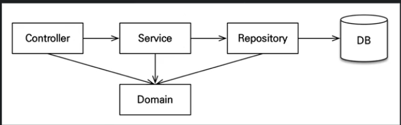

# Chapter 4, 5
## 애플리케이션 아키텍처

- 컨트롤러에서 레포지토리에 바로 접근도 가능하게
***
## @Transactional
- JPA는 트랜잭션안에서 실행되어야 
- @Transactional(readOnly = true)는 성능 최적화
- @Transactional는 기본이 false라 true 해두고 쓰기 있는 곳만 @Transactional적으면 된다.
***
## @RequiredArgsConstructor
```java
private MemberRepository memberRepository;
    
    public MemberService(MemberRepository memberRepository) {
        this.memberRepository = memberRepository;
    }
    
```
- 이렇게 하면 @Autowired 할 때 보다 repository를 변경하는데 용이하다?
- 원래는 MemberService 생성자에 @Autowired가 붙어야 하지만 생성자가 하나이기 때문에 안써도 됨
- 근데 저렇게 생성자를 쓰지 않고 @RequiredArgsConstructor 를 통해서 해결 할 수 있음
- 따라서 repository에 AUtowired나 생성자를 만들지 않아도 됨
- repository에서도 사용이 가능하다.
- 엔티티 매니저는 persistance 어쩌구로 인젝션 되는데, 스프링 부트에서는 이거로도 된다.
***
- @Rollback(false)를 하면 테스트할 때 데이터가 유지됨
***

## 예외처리
``` java
 memberService.join(member1);
        try{
            memberService.join(member2);
        } catch (IllegalStateException e) {
            return;
        }
```
- 이것과 @Test(expected = IllegalStateException.class) 이놈은 같다.

## Cascade
- 오더가 딜리버리를 관리하고, 오더가 오더 아이템을 관리하는 정도의 그림에서만 사용
- 다른 곳에서도 참조를 하면 막 CASCADE를 사용하면 안됨
- 그럴 경우 별도의 repository를 생성해야함